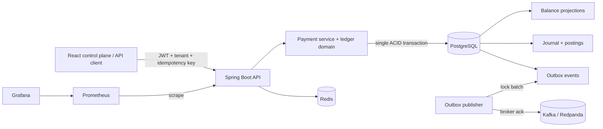

# ClearLedger

**A payment-orchestration and double-entry ledger platform built as a production system, not a dashboard mock-up.**

ClearLedger accepts idempotent account transfers, locks balances safely, writes balanced immutable journal entries, and publishes payment events through a transactional outbox. A React operations console exposes the same API used by integrations. The repository includes observability, container orchestration, security boundaries, database migrations, architecture tests, and CI.

> Portfolio positioning: this project demonstrates the sort of consistency, failure handling, security and operability decisions expected in backend and full-stack engineering—not merely CRUD screens.

## What makes it technically interesting

- **Money is stored in minor units** (`long`/`BIGINT`), avoiding floating-point errors.
- **Double-entry invariants exist twice:** in the Java aggregate and in a deferred PostgreSQL constraint trigger.
- **Concurrent payments use deterministic pessimistic row locking** plus optimistic version columns, preventing overspend and lock-order deadlocks.
- **Idempotency is tenant-scoped and payload-aware.** Replays return the original result; key reuse with a different payload fails.
- **Payment, balance projection, journal and outbox event commit atomically** in one database transaction.
- **Kafka publishing is at-least-once.** The outbox worker marks events only after broker acknowledgement, so consumers must deduplicate by event ID.
- **Tenant identity crosses every repository query.** The HTTP tenant header is a demo transport; production should derive it from a verified JWT claim.
- **Architecture rules are executable.** ArchUnit stops domain packages from depending on HTTP adapters.

## Stack

| Layer | Technology | Responsibility |
|---|---|---|
| Web | React 19, TypeScript, Vite, TanStack Query, React Router | Typed operations console, caching and mutation state |
| API | Java 21, Spring Boot 4, Spring MVC, Bean Validation | Versioned REST boundary and RFC-style errors |
| Security | Spring Security, OAuth2 Resource Server, JWT scopes | Stateless API authentication and write/read authorization |
| Data | PostgreSQL 17, Spring Data JPA, Flyway | ACID ledger, migrations, locks and database constraints |
| Messaging | Kafka-compatible Redpanda, transactional outbox | Reliable payment lifecycle events |
| Cache | Redis 8 | Production-ready cache/coordination dependency |
| Operations | Actuator, Micrometer, OpenTelemetry bridge, Prometheus, Grafana | Health, metrics and trace correlation |
| Delivery | Docker, Compose, Nginx, GitHub Actions | Reproducible runtime and gated builds |
| Quality | JUnit 5, Mockito, AssertJ, Testcontainers, ArchUnit, Oxlint | Unit, boundary, database and architecture verification |

## Architecture



The repository is a modular monolith by design. The ledger and payment consistency boundary stays inside one transaction while package boundaries preserve a future extraction path. See [the detailed architecture](docs/architecture.md) and [ADR-001](docs/adr/001-ledger-consistency.md).

## Run the entire platform

Prerequisite: Docker Desktop with Compose.

```bash
cp .env.example .env
docker compose up --build
```

| Service | URL |
|---|---|
| Operations console | http://localhost:3000 |
| Swagger UI | http://localhost:8080/docs |
| API health | http://localhost:8080/actuator/health |
| Redpanda Console | http://localhost:8090 |
| Prometheus | http://localhost:9090 |
| Grafana | http://localhost:3001 (admin / value from `.env`) |

The Compose environment runs the API with the `dev` profile so the UI can be explored without an identity provider. The default profile requires OAuth2 JWTs and scopes. This separation is explicit in `SecurityConfig`.

### Frontend-only portfolio demo

The UI has an explicit in-memory adapter—never a silent fallback—to make the portfolio experience available without infrastructure:

```bash
cd apps/control-plane
npm ci
VITE_DEMO_MODE=true npm run dev
```

On PowerShell: `$env:VITE_DEMO_MODE='true'; npm run dev`.

## API example

```bash
curl -X POST http://localhost:8080/api/v1/payments \
  -H 'Content-Type: application/json' \
  -H 'X-Tenant-Id: northstar' \
  -H 'Idempotency-Key: order-88422' \
  -d '{
    "merchantReference":"ORD-88422",
    "sourceAccountId":"11111111-1111-1111-1111-111111111111",
    "destinationAccountId":"33333333-3333-3333-3333-333333333333",
    "amountMinor":125000,
    "currency":"GBP",
    "description":"Merchant settlement"
  }'
```

Submitting the identical request with the same key is safe. Reusing the key for different payment data returns `409 Conflict`.

## The payment transaction

1. Validate the command and look up any prior idempotent result.
2. Lock both accounts in stable UUID order.
3. Verify tenant, status, currency and available funds.
4. Apply debit and credit balance projections.
5. Create two equal and opposite postings.
6. Post the journal, causing PostgreSQL to re-check balance.
7. Persist a versioned payment intent and outbox event.
8. Commit all state together—or roll all of it back.
9. Publish the outbox record to `payments.lifecycle.v1` and mark it published after acknowledgement.

## Verification

```bash
# Backend: unit + service + ArchUnit; integration test activates when Docker is present
cd services/ledger-api
./mvnw verify

# Frontend: static analysis + strict TypeScript + production bundle
cd apps/control-plane
npm ci
npm run lint
npm run build
```

CI repeats both pipelines, validates the Compose model, and builds production images. Testcontainers runs the real PostgreSQL migrations and exercises idempotent API calls when Docker is available.

## Repository map

```text
apps/control-plane/           React/TypeScript operations console
services/ledger-api/         Spring Boot application and tests
  src/main/.../account       Balance aggregate and locking repository
  src/main/.../ledger        Journal and posting invariants
  src/main/.../payment       Transactional payment use case
  src/main/.../outbox        At-least-once Kafka publisher
  src/main/resources/db      Versioned Flyway migrations
infra/                       Prometheus and Grafana provisioning
docs/adr/                    Architecture decisions and trade-offs
.github/workflows/ci.yml     Build, test and image pipeline
compose.yml                  Complete local platform
```

## Interview discussion prompts

- Why use a modular monolith instead of independent ledger and payment services?
- Why is an outbox safer than writing to PostgreSQL and Kafka independently?
- Where does exactly-once stop, and why must consumers remain idempotent?
- Why combine pessimistic locks with an optimistic version column?
- How would a reconciliation job prove projections match the journal?
- How should tenant identity move from a header to an authenticated claim?

## Deliberate next steps

This repository keeps the core complete and the roadmap honest. Production evolution would add a consumer-side inbox, automated journal-to-projection reconciliation, OIDC realm provisioning, rate limiting, and Kubernetes/Helm deployment. These are documented boundaries, not features claimed by the UI.

MIT licensed. See [the threat model](docs/threat-model.md) before using the design beyond a portfolio or learning environment.
