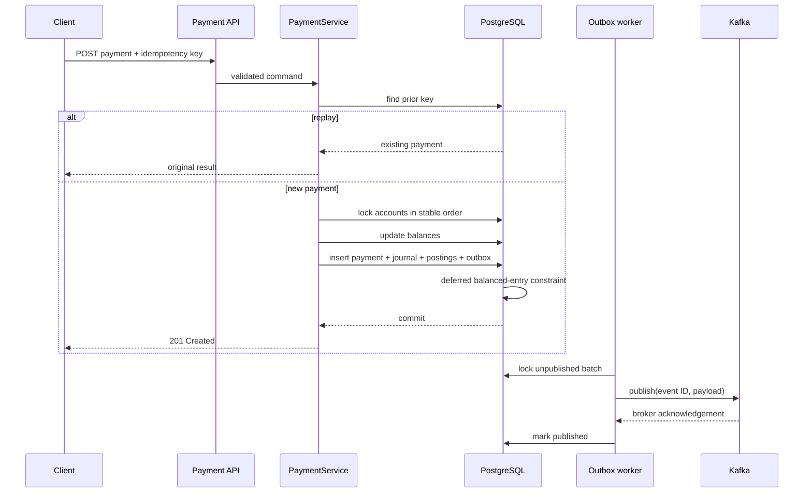

# Architecture

## Context

ClearLedger moves value between tenant-owned accounts. Its primary quality attributes are correctness, auditability, replay safety and diagnosability. Availability matters, but the service must reject work rather than invent, duplicate or lose money.

## Boundaries

The HTTP layer translates transport concerns into application commands. `PaymentService` owns the consistency use case. Domain entities own local invariants. Repositories isolate persistence. `OutboxPublisher` is an asynchronous adapter.

The modular monolith keeps account mutations, payments, journal postings and outbox insertion in one PostgreSQL transaction. Splitting them into services would introduce a distributed transaction or compensating workflow before the team has evidence that independent scaling is needed.

## Write sequence

## Consistency and concurrency

- Amounts are positive 64-bit minor units; currency is explicit.
- Source and destination account rows are pessimistically locked in lexicographic UUID order.
- The account `version` column detects stale writes outside the locked payment path.
- A journal cannot post unless total debits equal total credits and at least two postings exist.
- A PostgreSQL constraint trigger validates the same condition at the database boundary.
- Posted journal entries are immutable through the domain API.
- Tenant ID participates in all important uniqueness and lookup boundaries.

## Failure modes

| Failure | Behaviour |
|---|---|
| Validation/currency/funds failure | Transaction rolls back; no event exists |
| API process exits before commit | PostgreSQL rolls back |
| API exits after commit before response | Client retries the idempotency key and receives the existing payment |
| Broker unavailable | Outbox remains pending and is retried |
| Worker exits after broker ack before marking row | Event may be published again; consumer deduplicates by event ID |
| Two payments spend one account | Row lock serializes balance decisions |
| Opposing transfers | Stable lock ordering reduces deadlock risk |

## Scaling path

API replicas are stateless. PostgreSQL remains the serialization point for account mutation. Read replicas can serve journal/history queries if their lag is acceptable. Outbox workers use `SKIP LOCKED` semantics so multiple replicas can divide a batch. Hot accounts eventually require partitioning, reservation semantics, or a single-writer stream; those costs should be driven by measurements.

## Operational model

Actuator exposes liveness, readiness, metrics and Prometheus output. Incoming requests receive or preserve `X-Request-Id`; logs include trace and span IDs through Micrometer’s OpenTelemetry bridge. Dashboards should alert on error ratio, p95 latency, database pool saturation, outbox age—not merely outbox count—and Kafka publish errors.
